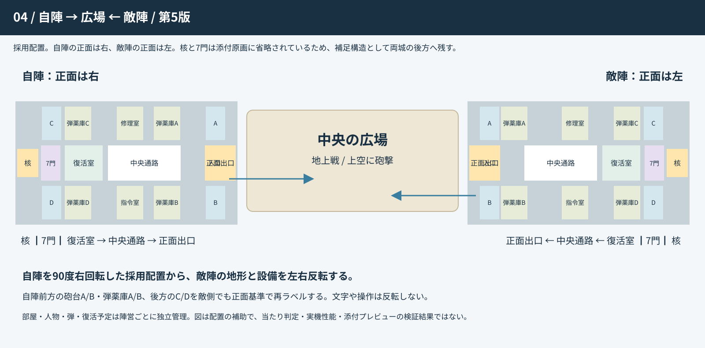

# 現行計画書 / 第5版
[計画書全文](PRODUCT_REQUIREMENTS.md) → [採用図と配置](MAP_ADOPTION.md) → [画面・広場・復活](SCREEN_FLOW_AND_BATTLEFIELD.md) → [結果・ランキング](RESULTS_SCORE_RANKING.md) → [実装担当へ](AI_HANDOFF.md)

## 図面

[画面遷移](drawings/01_SCREEN_FLOW.svg) / [3種類のゲーム画面](drawings/02_THREE_GAME_VIEWS.svg) / [自陣の移動用平面図](drawings/03_HOME_MOVEMENT_MAP.svg)

核室と7門は採用図で省略されているため補足平面図に残す。図面は設計資料であり、ゲームの完成画面ではない。
REQUIREMENTS.jsonとACCEPTANCE_TESTS.jsonを実装・検査へ結び付ける。検査計画は未実施。validate_documents.pyの結果は資料検査のみ。
