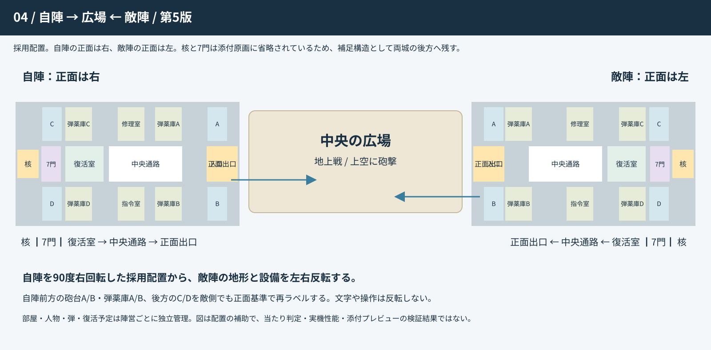

# 現行計画書 / 第5版

## 公開までの作業工程（2026年10月2日）

[公開までの実装計画書](RELEASE_IMPLEMENTATION_PLAN.md)を最新の作業順序と提出単位にする。PR #72後の残件を5工程へまとめ、各工程内の実装・修正・検査・記録を完了してから原則1本のDraft PRにする。第5版の製品条件は維持し、旧引き継ぎの小単位案は履歴として読む。計画書の追加だけでゲーム機能・検査設定・外部登録・公開は変更しない。

[計画書全文](PRODUCT_REQUIREMENTS.md) → [採用図と配置](MAP_ADOPTION.md) → [画面・広場・復活](SCREEN_FLOW_AND_BATTLEFIELD.md) → [結果・ランキング](RESULTS_SCORE_RANKING.md) → [実装担当へ](AI_HANDOFF.md)

## 図面

核室と7門は採用画像で省略されているため、上の補足構造図に残す。図面は設計資料であり、ゲームの完成画面ではない。
今回の第5版は、採用配置（4砲台・4弾薬庫・4/4/8/14）・画面遷移・広場戦・5秒観戦復活・結果画面・初期公開必須の上位10位ランキングを第4版より優先する。`SCORE_PLAN.json`と`RANKING_INTEGRATION_PLAN.json`は接続前の計画資料で、null値を送信設定とみなさない。REQUIREMENTS.json、ACCEPTANCE_TESTS.json、INITIAL_RULES.json、ENEMY_ROSTER.json、INTERIOR_LAYOUTS.jsonは第5版の内容へ同期済みである。R1の基礎実装と採用配置確認は実装済み。検査の実施範囲は [検査記録](../../TEST_REPORT.md) を参照する。通常戦の完成挙動、ランキング接続・その他の外部接続、試遊、iPhone実機検査は未実施。
